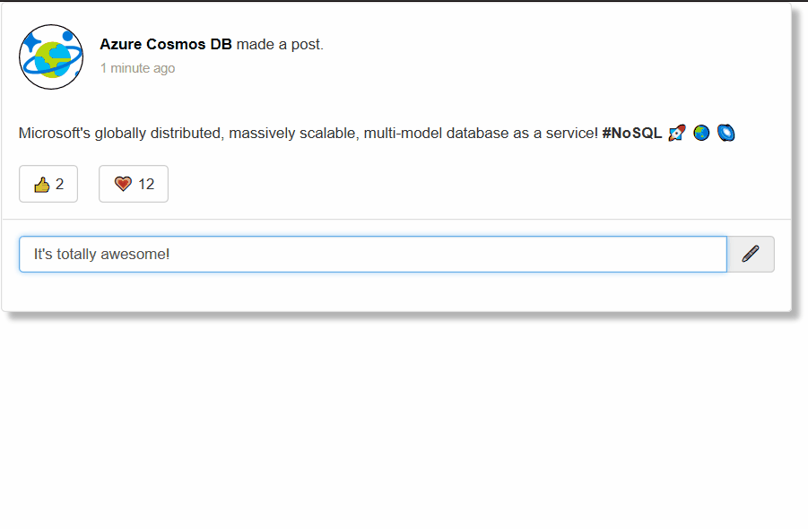
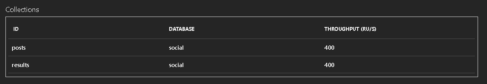
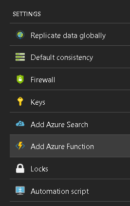
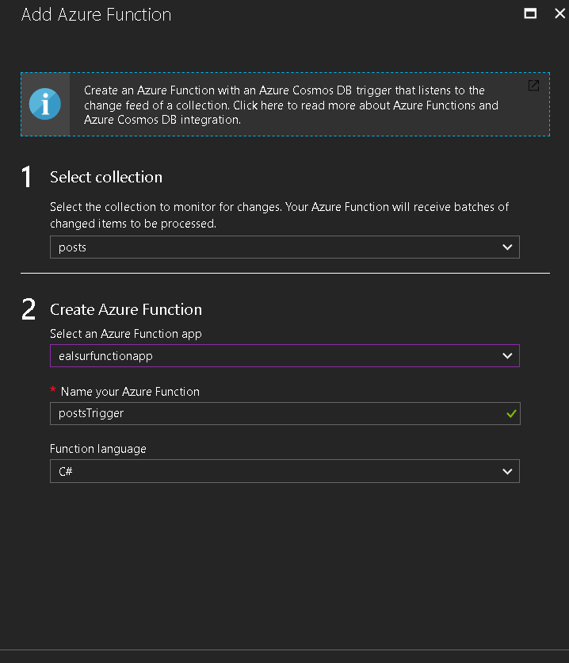
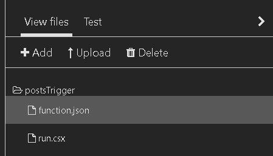
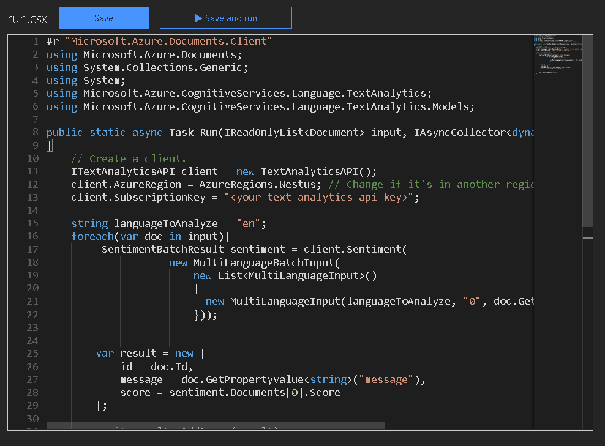
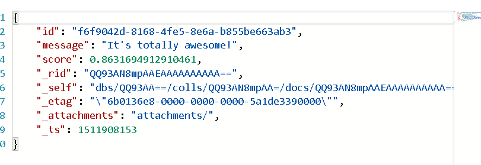

# Azure Cosmos DB social analytics sample

>**New** and updated sample of this scenario [here](https://github.com/ealsur/serverless-recipes/tree/master/cosmosdbtrigger).

This sample repository shows a simple social network where posts are stored in [Azure Cosmos DB](https://azure.microsoft.com/services/cosmos-db/), and as soon as data is inserted, it leverages [Azure Function's CosmosDBTrigger](https://docs.microsoft.com/azure/azure-functions/functions-create-cosmos-db-triggered-function) to analyze the text with [Azure Cognitive Text Analytics API](https://azure.microsoft.com/services/cognitive-services/text-analytics/) and obtain insights on the user's intention.

> For more information regarding **serverless architectures** with Azure Cosmos DB and Azure Functions, please visit the [complete article](https://docs.microsoft.com/azure/cosmos-db/serverless-computing-database).

## Requirements

To run this demo you will need:

* An [Azure Cosmos DB account with SQL API](https://docs.microsoft.com/azure/cosmos-db/documentdb-introduction)
* An Azure Function App
* An instance of Azure Text Analytics API

You can create all of these services from within the Azure Portal.

If you don't have an Azure Subscription you can create a [free account today](https://azure.microsoft.com/free/).

Additionally, this demo contains an ASP.NET Core Web application, you will need [.NET Core SDK](http://get.asp.net/) to be able to run it, but you can do so in **any platform** (Windows, Linux or Mac).

## A word on resources usage

The cost of running this demo is low in terms of Azure services but just so it is clear what's going to be created:

* The demo will create 3 400 RU/s collections in your Azure Cosmos DB account, this has **an hourly cost of USD $ 0.096** approximatelly.
* If your Azure Function App is running in App Service Mode, no additional costs will occur. If it's running in Consumption Mode, you might get charged for a couple of executions during the demo.
* Text Analytics API has a free tier with 5,000 monthly calls free of charge.

Remember to **delete the collections once you are done playing with the demo** :)

## Getting started

After you clone this repository, go to the [webapp](./webapp) folder, find the [appsettings.json](./webapp/appsettings.json) file and edit the `Endpoint` and `Key` configuration settings to match those of your Azure Cosmos DB account.

    {
      "Logging": {
        "IncludeScopes": false,
        "LogLevel": {
          "Default": "Warning"
        }
      },
      "CosmosDB": {
        "Endpoint": "https://<your-account-name>.documents.azure.com:443/",
        "Key": "<your-account-key>"
      }
    }

Now from your command prompt, you can run `dotnet run` from within the folder to restore dependencies and run the application.

This action will automatically **create the collections** in your account:

* *posts* will hold the content/messages created by the user
* *results* will hold the Text Analytics API evaluation results
* *leases*  will be used for the Azure Functions integration

## Automating content analysis

Now go to the **Add Azure Function** menu item in your Azure Cosmos DB account:

Select the `posts` collection and then select your existing Azure Function App:

After clicking `Save` your function will be created and hooked to the `posts` collection with some default and simple code.

We will now customize the code in a way that, after each new content/message inserted, we will call Text Analytics, analyze and store the results **without modifying any line of code in the web application**.

You need to upload one the [project.json](./function/project.json) file to your Azure Function to include the Text Analytics Nuget package.

Then click on your `function.json` file and replace its contents with the [function.json](./function/function.json) file included in this repository.

Now click in your `run.csx` file and do the same with the [run.csx](./function/run.csx) file included in this repository. You will need to edit the content to add your Text Analytics API Key:

Finally, `Save` your file and go to the running Web application in your local environment, write some comment on the text input and click on the pencil and wait :)

Your message will be saved on the `posts` collection, picked up by the Azure Function, analyzed, the result will be stored in the `results` collection and the Web application will pull it and show it on the UI.

